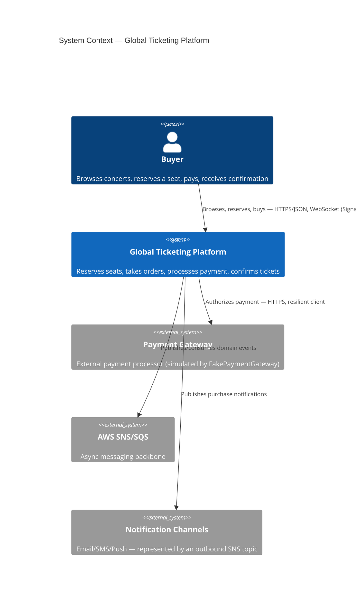
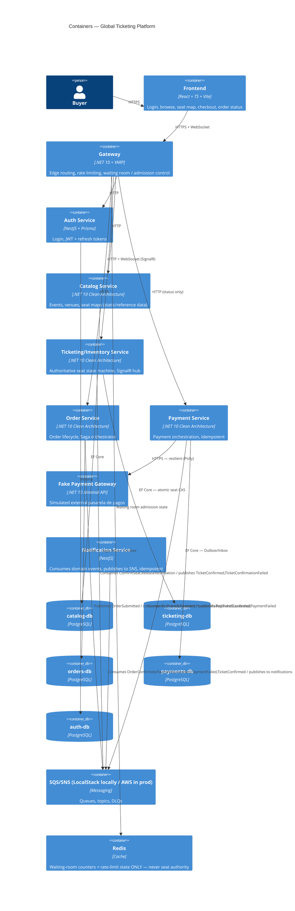
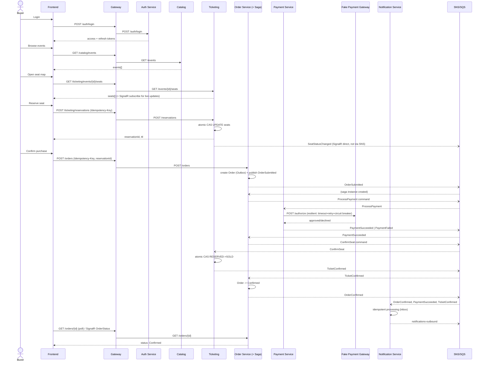
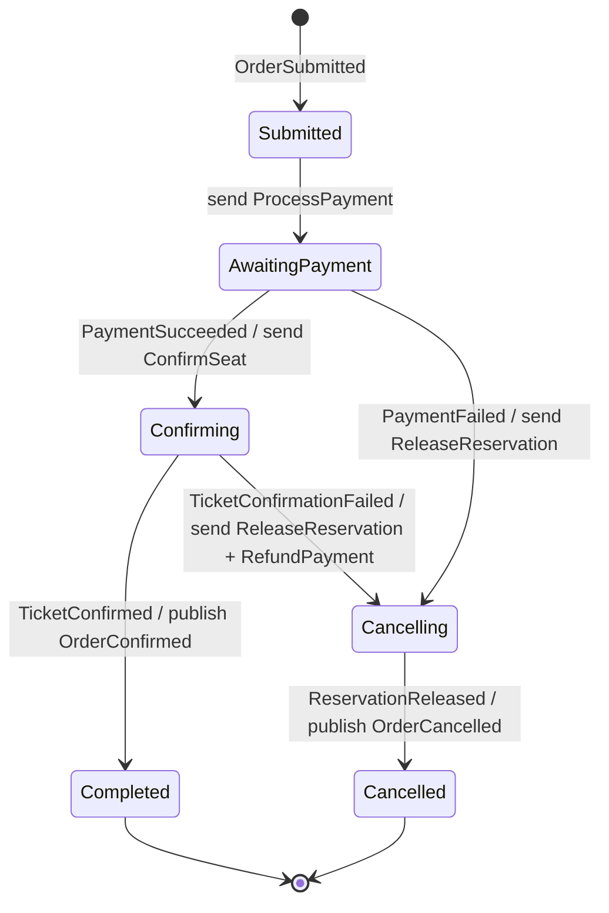
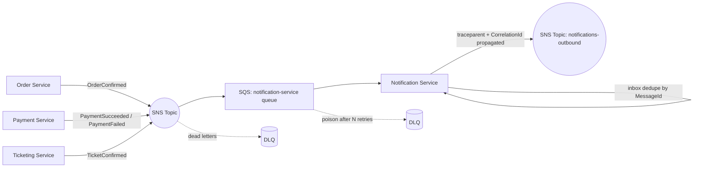
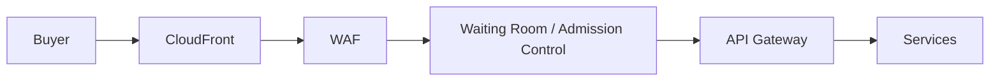
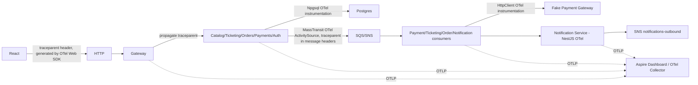
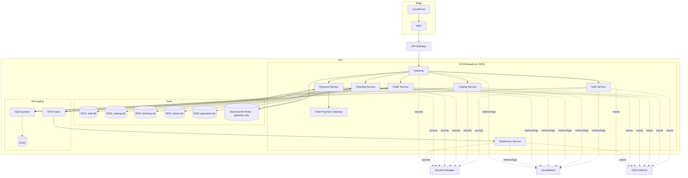

# ARCHITECTURE.md — Global Ticketing Platform

Status: living document. This defines the architecture BEFORE implementation, per the governing prompt (`global-ticketing-platform-agent-prompt.md`). Scope framing: this is a **PoC++ demo** — every flow described here must be genuinely functional end-to-end locally (via .NET Aspire and/or Kubernetes-local), not just diagrammed. Where something is intentionally scaffolded rather than production-hardened, that is called out explicitly and logged in `DECISIONS.md`.

Priority order for every trade-off in this document: **Correctness > Reliability > Observability > Scalability > Convenience.**

---

## 1. Problem framing

Baseline traffic is low. When a popular concert goes on sale, the platform receives millions of concurrent requests within seconds, all contending for a small number of seats. The system must:

- Never sell the same seat twice, under any concurrency or failure condition.
- Keep seat availability close to real-time for users browsing.
- Integrate safely with an external payment gateway (timeouts, declines, duplicate callbacks).
- Tolerate partial failures between services without corrupting state.
- Tolerate duplicate operations caused by client/network retries.
- Provide end-to-end traceability for any single purchase, across HTTP, queues, and databases.

---

## 2. System Context



---

## 3. Containers / Microservices



---

## 4. Microservice responsibilities

| Service | Stack | Owns | Does NOT own |
|---|---|---|---|
| **Gateway** | .NET 10 + YARP | Routing, rate limiting, waiting room admission, WAF-equivalent header/size checks | Business logic, auth decisions (delegates JWT validation downstream) |
| **Auth Service** | NestJS + Prisma + Postgres | Users, credentials, JWT issuance, refresh token rotation | Seat/order/payment data |
| **Catalog Service** | .NET 10 Clean Architecture + EF Core + Postgres | Events, venues, seat map layout (reference data, low write volume) | Seat availability state (that's Ticketing's) |
| **Ticketing/Inventory Service** | .NET 10 Clean Architecture + EF Core + Postgres | **Sole authoritative** seat state (`AVAILABLE`/`RESERVED`/`SOLD`), reservation TTL, SignalR broadcast | Payments, orders |
| **Order Service** | .NET 10 Clean Architecture + EF Core + Postgres + MassTransit Saga | Order lifecycle, Saga orchestration (Reserve confirmed → Create Order → Payment → Confirm) | Seat state, payment state (commands them, doesn't own their data) |
| **Payment Service** | .NET 10 Clean Architecture + EF Core + Postgres | Payment attempts, idempotent processing, calls external gateway | Card data (never stored) |
| **Fake Payment Gateway** | .NET 10 Minimal API | Simulated external pasarela — success/decline/timeout/duplicate-callback/delayed-response | Everything else — stateless simulator |
| **Notification Service** | NestJS + AWS SDK + OTel | Consuming domain events, idempotent fan-out to SNS | Transactional/business state |
| **Frontend** | React + TS + Vite | UI/UX only | Business rules (always re-validated server-side) |

---

## 5. Consistency model

### 5.1 Seat inventory (the correctness-critical path)

Ticketing Service is the **single authoritative owner** of seat state. No other service, and no cache (Redis included), may decide whether a seat is sellable.

State machine:

```text
AVAILABLE --reserve(ttl)--> RESERVED --confirm--> SOLD
RESERVED --expire/release--> AVAILABLE
```

**Strategy chosen: atomic conditional `UPDATE` (compare-and-swap in SQL), not pessimistic locks, not Redis locks.** Full rationale in [`docs/adr/0002-seat-consistency-strategy.md`](docs/adr/0002-seat-consistency-strategy.md). Summary:

```sql
UPDATE seats
SET status = 'RESERVED', reservation_id = @reservationId, reserved_until = now() + @ttl, updated_at = now()
WHERE id = @seatId
  AND (status = 'AVAILABLE' OR (status = 'RESERVED' AND reserved_until < now()));
```

The affected-row-count from this single statement (0 or 1) is the entire concurrency decision — Postgres's row-level MVCC write lock inside one UPDATE guarantees exactly one concurrent transaction wins when N requests target the same row. No app-level lock, no distributed lock, no extra round trip is needed. Confirming to `SOLD` and releasing back to `AVAILABLE` use the same CAS shape, keyed additionally by `reservation_id` so only the reservation holder can transition it. A background sweep (hosted service) additionally reclaims expired reservations for observability/metrics, but correctness never depends on the sweep running — it's covered lazily by the `WHERE` clause above on every new reservation attempt.

This is proven under `tests/Ticketing.ConcurrencyTests`: N parallel reservation attempts on the same seat, asserting exactly 1 success and N-1 deterministic failures.

### 5.2 Cross-service consistency: Saga, not 2PC

No distributed transactions. The purchase flow is a **choreographed-orchestration hybrid**: Order Service hosts a MassTransit **Saga State Machine** that orchestrates Create Order → Process Payment → Confirm Seat by sending commands and reacting to events; Ticketing and Payment services remain autonomous over their own data. See [`docs/adr/0003-saga-vs-distributed-transaction.md`](docs/adr/0003-saga-vs-distributed-transaction.md).

### 5.3 Idempotency

Two independent layers, because they guard against two different failure modes:

1. **Client-facing `Idempotency-Key`** (HTTP header) on `POST /reservations`, `POST /orders`, `POST /payments`: guards against the buyer's browser/proxy retrying a write. Implemented once in `building-blocks/idempotency`, enforced via `UNIQUE` constraint on `(endpoint, idempotency_key)` as the last line of defense.
2. **Message Inbox** (MassTransit EF Core Outbox's built-in `InboxState`): guards against at-least-once delivery from SQS redelivering a message the consumer already processed. Enabled per receive endpoint.

See [`docs/adr/0006-idempotency-strategy.md`](docs/adr/0006-idempotency-strategy.md).

---

## 6. Purchase sequence (vertical slice)



---

## 7. Saga flow (Order Service)



Compensation path matches the prompt exactly: `Payment Failed → Cancel Order → Release Reservation`. The extra `Confirming → Cancelling` edge (seat confirmation itself fails, e.g. TTL lapsed mid-flight) additionally triggers a refund command to Payment Service — not explicitly requested but required for correctness (money must never be captured for a seat that wasn't actually confirmed); logged in `DECISIONS.md`.

---

## 8. Notification flow



Order/Payment/Ticketing never call Notification directly — fully decoupled via SNS/SQS, per the prompt's explicit requirement.

---

## 9. Massive traffic path



Locally, this diagram is approximated differently per environment (DECISIONS.md D17):

- **Aspire dev**: CloudFront/WAF/API Gateway aren't run; their role is played by the **Gateway**
  service (YARP), which implements the bullets below.
- **K8s**: a real **API Gateway** runs too, via LocalStack (`infrastructure/aws-local`) — 5 direct
  routes replacing YARP entirely, plus a Lambda JWT authorizer (new enforcement — neither YARP nor
  any downstream service validated JWTs before this). Rate limiting/waiting room/WAF-equivalent
  checks don't carry over 1:1 to API Gateway; see D17 for exactly what did and didn't move, and
  why. Aspire is unaffected — it keeps YARP doing everything below, unchanged.

What YARP implements, in the environment where it's still the edge (Aspire dev, and previously
K8s too):

- **Rate limiting**: ASP.NET Core built-in `Microsoft.AspNetCore.RateLimiting` (sliding window per IP/user, no extra dependency).
- **Load shedding**: fixed-size request queue per route; requests beyond queue depth get `503` with `Retry-After` immediately rather than queuing indefinitely.
- **Waiting Room / Admission Control**: token-bucket admission counter in Redis (shared across gateway replicas — this is the one legitimate use of Redis in this system; it is a **traffic-shaping** concern, never a seat-authority concern). Buyers above the concurrent-admission threshold receive a queue position + poll/WebSocket wait-token; only admitted requests reach Ticketing/Order write endpoints.
- **Backpressure**: SQS naturally backpressures the async chain (Payment/Ticketing/Notification consumers pull at their own pace); MassTransit concurrency limits (`UseConcurrencyLimit`) cap per-service in-flight message processing.
- **Caching**: Catalog (event/seat-map reference data) is cacheable at the gateway/CDN edge with short TTL; **seat availability is explicitly never cached as authoritative** — SignalR pushes best-effort live updates, but every reservation is re-validated against Postgres.
- **Queueing**: reservation attempts are synchronous+atomic (must be, to give the buyer an immediate answer), but everything downstream of "order submitted" (payment, confirmation, notification) is queued via SQS so write-side services scale independently of the traffic spike.
- **Horizontal scaling**: every service is stateless (session state in JWT, seat state in Postgres, waiting-room state in Redis) so K8s HPA can scale replicas freely; Postgres is the one component that must scale vertically/via read replicas, not horizontally, which is exactly why seat writes are kept to a single tiny atomic statement.

See [`docs/adr/0008-waiting-room-admission-control.md`](docs/adr/0008-waiting-room-admission-control.md).

---

## 10. Observability trace flow



A single `traceparent` (W3C Trace Context) flows automatically through .NET's `Activity` API end-to-end (ASP.NET Core, `HttpClient`, Npgsql, and MassTransit all natively participate in `System.Diagnostics.ActivitySource`). NestJS services use `@opentelemetry/instrumentation-http`/`aws-sdk` to continue the same trace. A separate business-level `CorrelationId` (= OrderId once an order exists, else a client-generated GUID from first request) is carried as an explicit message header/log-scope property, because it must survive across saga steps that may span multiple distinct OTel traces (a new trace legitimately starts at each async message boundary, but the business correlation must not reset). Selecting one purchase's `CorrelationId` in the Aspire dashboard reconstructs the full distributed operation. No PII, JWTs, payment tokens, or passwords are ever added to a log or span attribute — enforced centrally in `building-blocks/observability` via an enrichment allowlist rather than per-call discipline.

---

## 10.5 Deployment (AWS target architecture)



Provisioned via Terraform (`infrastructure/terraform`) as a structural skeleton — see `DECISIONS.md` D4 for scope (not applied against a real AWS account in this build).

## 11. Monorepo structure

```text
/apps
  /frontend                     React + TS + Vite

/services
  /gateway                      .NET 10 + YARP — routing, rate limiting, waiting room
  /auth-service                 NestJS + Prisma + Passport + JWT
  /notification-service         NestJS + AWS SDK + OTel
  /catalog                      .NET 10 Clean Architecture (Api/Application/Domain/Infrastructure)
  /ticketing                    .NET 10 Clean Architecture — seat authority + SignalR
  /orders                       .NET 10 Clean Architecture — Saga state machine
  /payments                     .NET 10 Clean Architecture — payment orchestration
    /FakePaymentGateway          .NET 10 Minimal API — simulated external pasarela

/building-blocks
  /messaging                    MassTransit conventions, outbox/inbox setup helpers, topology naming
  /observability                Serilog + OTel wiring, log-scrubbing enrichers, CorrelationId propagation
  /idempotency                  Idempotency-Key ASP.NET Core filter + storage contract

/aspire
  /AppHost                      Local orchestration: Postgres x5, LocalStack, Redis, all services, frontend
  /ServiceDefaults               Shared OTel/health/resilience wiring for .NET projects only

/infrastructure
  /terraform                    Target AWS architecture (skeleton — see DECISIONS.md for scope)
  /docker                       Dockerfiles per service
  /k8s                          Kustomize manifests for local kind/minikube validation

/tests
  /Ticketing.ConcurrencyTests    N-parallel same-seat reservation race test
  /Orders.SagaTests              MassTransit test harness saga tests
  /*.IntegrationTests            Testcontainers-backed per-service integration tests
  /notification-service (Jest)  duplicate-consumption, idempotency, SNS publish, trace propagation, retry tests

/docs
  /adr                          Architecture Decision Records
  /diagrams                     Standalone copies of the Mermaid diagrams above
```

`building-blocks` intentionally contains **no domain entities and no shared DbContext** — only cross-cutting infrastructure conventions (naming, middleware, telemetry wiring). Each service still writes its own copy of any integration-event contract it consumes (see [`docs/adr/0004-sqs-sns-messaging.md`](docs/adr/0004-sqs-sns-messaging.md)). This is deliberate: the prompt requires **no shared domain entities and no coupling SharedKernel**, and a shared contracts assembly would recreate exactly that coupling by another name.

---

## 12. Environments & local dev experience

- **`.NET Aspire`** (`aspire/AppHost`) is the primary local dev experience: `dotnet run` in AppHost brings up all 5 Postgres instances, LocalStack (SQS/SNS), Redis, all 4 .NET services + Gateway + FakePaymentGateway, both NestJS services (via Aspire's `AddNpmApp`), and the Vite frontend, wired with service discovery and OTLP export to the Aspire dashboard.
- **Kubernetes-local** (`infrastructure/k8s`, Kustomize) is the secondary target, since the explicit goal of this PoC is validating how these microservices behave under Kubernetes. Images are built via the Dockerfiles in `infrastructure/docker` and loaded into a local `kind`/`minikube` cluster. Scope decisions (single shared Postgres pod hosting five databases locally vs one instance per service in Terraform/AWS) are in `DECISIONS.md`.

---

## 13. What "vertical slice first" means here

Per the prompt: build the critical path first — `Login → Browse Event → View Seats → Reserve Seat → Create Order → Payment → Confirm Ticket → Notification` — fully wired and tested, before breadth (secondary endpoints, full CRUD admin surfaces, exhaustive Terraform, etc.). Section-by-section completion status is tracked in `DECISIONS.md` as the build progresses.

See also: [`DECISIONS.md`](DECISIONS.md) for scope/pragmatism calls made along the way, and [`docs/adr/`](docs/adr/) for the required architecture decision records.
