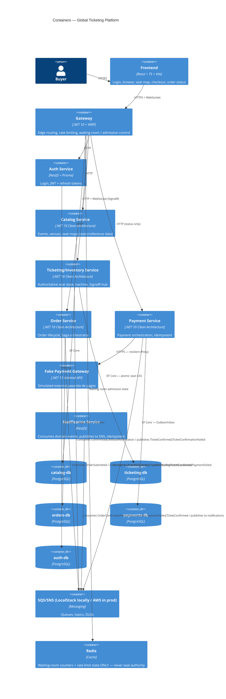

# Containers / Microservices

```mermaid
C4Container
title Containers — Global Ticketing Platform

Person(buyer, "Buyer")

Container(frontend, "Frontend", "React + TS + Vite", "Login, browse, seat map, checkout, order status")
Container(gateway, "Gateway", ".NET 10 + YARP", "Edge routing, rate limiting, waiting room / admission control")
Container(auth, "Auth Service", "NestJS + Prisma", "Login, JWT + refresh tokens")
Container(catalog, "Catalog Service", ".NET 10 Clean Architecture", "Events, venues, seat maps (static/reference data)")
Container(ticketing, "Ticketing/Inventory Service", ".NET 10 Clean Architecture", "Authoritative seat state machine, SignalR hub")
Container(orders, "Order Service", ".NET 10 Clean Architecture", "Order lifecycle, Saga orchestrator")
Container(payments, "Payment Service", ".NET 10 Clean Architecture", "Payment orchestration, idempotent")
Container(fakegw, "Fake Payment Gateway", ".NET 10 Minimal API", "Simulated external pasarela de pagos")
Container(notification, "Notification Service", "NestJS", "Consumes domain events, publishes to SNS, idempotent")

ContainerDb(catalogdb, "catalog-db", "PostgreSQL")
ContainerDb(ticketingdb, "ticketing-db", "PostgreSQL")
ContainerDb(ordersdb, "orders-db", "PostgreSQL")
ContainerDb(paymentsdb, "payments-db", "PostgreSQL")
ContainerDb(authdb, "auth-db", "PostgreSQL")

Container(sqs, "SQS/SNS (LocalStack locally / AWS in prod)", "Messaging", "Queues, topics, DLQs")
Container(redis, "Redis", "Cache", "Waiting-room counters + rate-limit state ONLY — never seat authority")

Rel(buyer, frontend, "HTTPS")
Rel(frontend, gateway, "HTTPS + WebSocket")
Rel(gateway, auth, "HTTP")
Rel(gateway, catalog, "HTTP")
Rel(gateway, ticketing, "HTTP + WebSocket (SignalR)")
Rel(gateway, orders, "HTTP")
Rel(gateway, payments, "HTTP (status only)")
Rel(gateway, redis, "Waiting room admission state")

Rel(auth, authdb, "Prisma")
Rel(catalog, catalogdb, "EF Core")
Rel(ticketing, ticketingdb, "EF Core — atomic seat CAS")
Rel(orders, ordersdb, "EF Core — Saga state + Outbox")
Rel(payments, paymentsdb, "EF Core — Outbox/Inbox")
Rel(payments, fakegw, "HTTPS — resilient (Polly)")

Rel(orders, sqs, "Publishes OrderSubmitted / consumes PaymentSucceeded,PaymentFailed,TicketConfirmed")
Rel(payments, sqs, "Consumes ProcessPayment / publishes PaymentSucceeded,PaymentFailed")
Rel(ticketing, sqs, "Consumes ConfirmSeat,ReleaseReservation / publishes TicketConfirmed,TicketConfirmationFailed")
Rel(notification, sqs, "Consumes OrderConfirmed,PaymentSucceeded,PaymentFailed,TicketConfirmed / publishes to notifications-outbound SNS topic")
```

See `ARCHITECTURE.md` §3-4 for responsibilities table.
