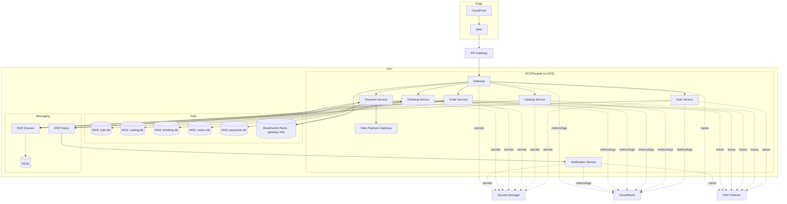

# Deployment (AWS target architecture)

```mermaid
flowchart TB
    subgraph Edge
        CF[CloudFront]
        WAF[WAF]
    end
    CF --> WAF --> APIGW[API Gateway]

    subgraph VPC
        subgraph ECS["ECS/Fargate (or EKS)"]
            GW[Gateway]
            AUTH[Auth Service]
            CAT[Catalog Service]
            TIX[Ticketing Service]
            ORD[Order Service]
            PAY[Payment Service]
            FGW[Fake Payment Gateway]
            NOTIF[Notification Service]
        end
        subgraph Data
            RDS1[(RDS: auth-db)]
            RDS2[(RDS: catalog-db)]
            RDS3[(RDS: ticketing-db)]
            RDS4[(RDS: orders-db)]
            RDS5[(RDS: payments-db)]
            REDIS[(ElastiCache Redis - gateway only)]
        end
        subgraph Messaging
            SQS[SQS Queues]
            SNS[SNS Topics]
            DLQ[(DLQs)]
        end
    end

    SM[Secrets Manager]
    CW[CloudWatch]
    OTEL[OTel Collector]

    APIGW --> GW
    GW --> AUTH & CAT & TIX & ORD & PAY
    AUTH --> RDS1
    CAT --> RDS2
    TIX --> RDS3
    ORD --> RDS4
    PAY --> RDS5
    PAY --> FGW
    GW --> REDIS
    TIX --> REDIS

    ORD & PAY & TIX <--> SQS
    ORD & PAY & TIX --> SNS
    SNS --> NOTIF
    SQS -.-> DLQ

    AUTH & CAT & TIX & ORD & PAY & NOTIF & GW -.secrets.-> SM
    AUTH & CAT & TIX & ORD & PAY & NOTIF & GW -.metrics/logs.-> CW
    AUTH & CAT & TIX & ORD & PAY & NOTIF & GW -.traces.-> OTEL
```

See `ARCHITECTURE.md` §10.5. Provisioned via `infrastructure/terraform` (skeleton, not applied — `DECISIONS.md` D4).
