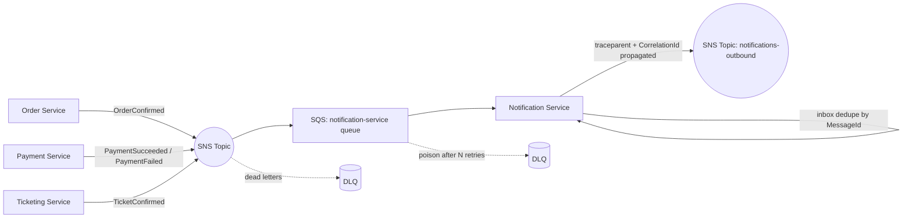

# Notification Flow

```mermaid
flowchart LR
    ORD[Order Service] -->|OrderConfirmed| SNS1((SNS Topic))
    PAY[Payment Service] -->|PaymentSucceeded / PaymentFailed| SNS1
    TIX[Ticketing Service] -->|TicketConfirmed| SNS1
    SNS1 --> SQSN[SQS: notification-service queue]
    SQSN --> NOTIF[Notification Service]
    NOTIF -->|inbox dedupe by MessageId| NOTIF
    NOTIF -->|traceparent + CorrelationId propagated| SNS2((SNS Topic: notifications-outbound))
    SNS1 -.dead letters.-> DLQ1[(DLQ)]
    SQSN -.poison after N retries.-> DLQ2[(DLQ)]
```

See `ARCHITECTURE.md` §8 and `docs/adr/0009-notification-architecture-nestjs-sns.md`.
