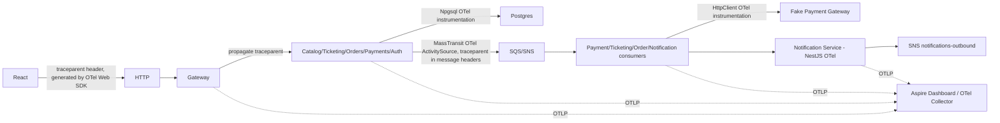

# Observability Trace Flow

```mermaid
flowchart LR
    React -->|traceparent header, generated by OTel Web SDK| HTTP
    HTTP --> Gateway
    Gateway -->|propagate traceparent| APIs[Catalog/Ticketing/Orders/Payments/Auth]
    APIs -->|Npgsql OTel instrumentation| Postgres
    APIs -->|MassTransit OTel ActivitySource, traceparent in message headers| SQS_SNS[SQS/SNS]
    SQS_SNS --> Consumers[Payment/Ticketing/Order/Notification consumers]
    Consumers -->|HttpClient OTel instrumentation| FakeGateway[Fake Payment Gateway]
    Consumers --> NotificationService[Notification Service - NestJS OTel]
    NotificationService --> SNS2[SNS notifications-outbound]

    APIs -.OTLP.-> Aspire[Aspire Dashboard / OTel Collector]
    Consumers -.OTLP.-> Aspire
    NotificationService -.OTLP.-> Aspire
    Gateway -.OTLP.-> Aspire
```

See `ARCHITECTURE.md` §10.
