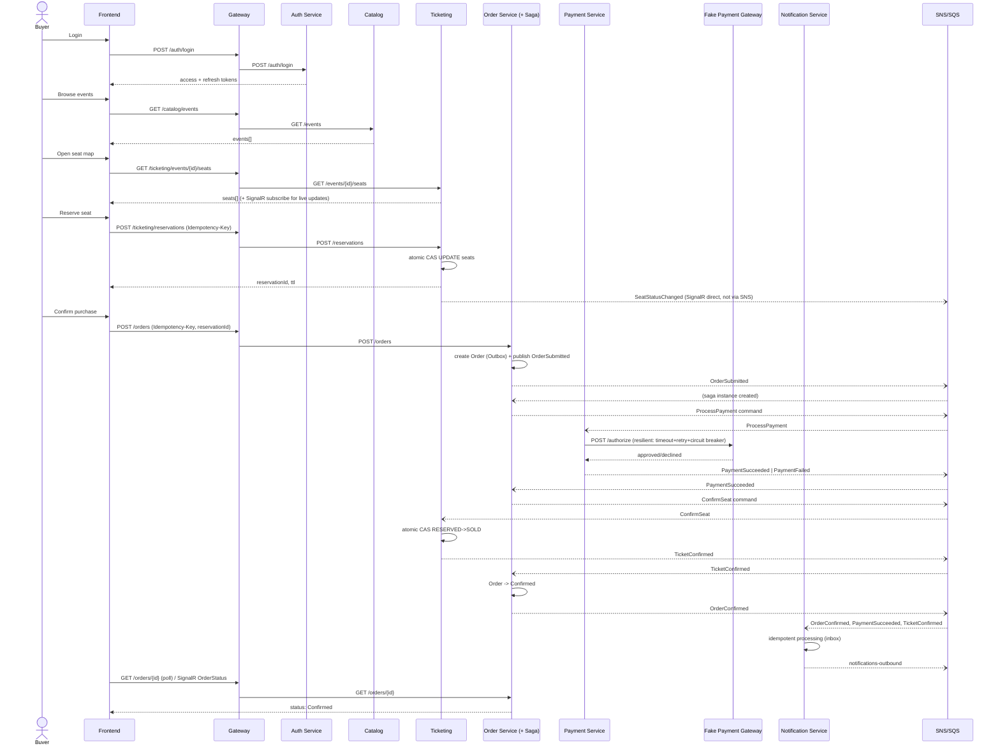

# Purchase Sequence

```mermaid
sequenceDiagram
    actor Buyer
    participant FE as Frontend
    participant GW as Gateway
    participant AUTH as Auth Service
    participant CAT as Catalog
    participant TIX as Ticketing
    participant ORD as Order Service (+ Saga)
    participant PAY as Payment Service
    participant FGW as Fake Payment Gateway
    participant NOTIF as Notification Service
    participant SNS as SNS/SQS

    Buyer->>FE: Login
    FE->>GW: POST /auth/login
    GW->>AUTH: POST /auth/login
    AUTH-->>FE: access + refresh tokens

    Buyer->>FE: Browse events
    FE->>GW: GET /catalog/events
    GW->>CAT: GET /events
    CAT-->>FE: events[]

    Buyer->>FE: Open seat map
    FE->>GW: GET /ticketing/events/{id}/seats
    GW->>TIX: GET /events/{id}/seats
    TIX-->>FE: seats[] (+ SignalR subscribe for live updates)

    Buyer->>FE: Reserve seat
    FE->>GW: POST /ticketing/reservations (Idempotency-Key)
    GW->>TIX: POST /reservations
    TIX->>TIX: atomic CAS UPDATE seats
    TIX-->>FE: reservationId, ttl
    TIX--)SNS: SeatStatusChanged (SignalR direct, not via SNS)

    Buyer->>FE: Confirm purchase
    FE->>GW: POST /orders (Idempotency-Key, reservationId)
    GW->>ORD: POST /orders
    ORD->>ORD: create Order (Outbox) + publish OrderSubmitted
    ORD--)SNS: OrderSubmitted
    SNS--)ORD: (saga instance created)
    ORD--)SNS: ProcessPayment command
    SNS--)PAY: ProcessPayment
    PAY->>FGW: POST /authorize (resilient: timeout+retry+circuit breaker)
    FGW-->>PAY: approved/declined
    PAY--)SNS: PaymentSucceeded | PaymentFailed
    SNS--)ORD: PaymentSucceeded
    ORD--)SNS: ConfirmSeat command
    SNS--)TIX: ConfirmSeat
    TIX->>TIX: atomic CAS RESERVED->SOLD
    TIX--)SNS: TicketConfirmed
    SNS--)ORD: TicketConfirmed
    ORD->>ORD: Order -> Confirmed
    ORD--)SNS: OrderConfirmed
    SNS--)NOTIF: OrderConfirmed, PaymentSucceeded, TicketConfirmed
    NOTIF->>NOTIF: idempotent processing (inbox)
    NOTIF--)SNS: notifications-outbound

    FE->>GW: GET /orders/{id} (poll) / SignalR OrderStatus
    GW->>ORD: GET /orders/{id}
    ORD-->>FE: status: Confirmed
```

See `ARCHITECTURE.md` §6.
