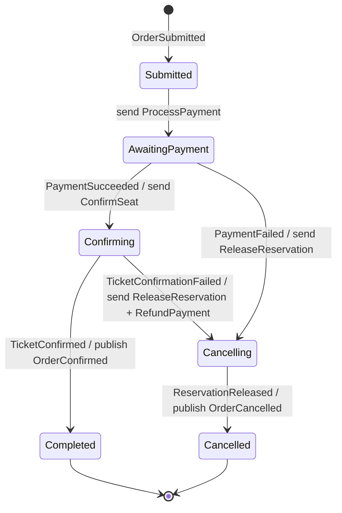

# Saga Flow (Order Service)

```mermaid
stateDiagram-v2
    [*] --> Submitted: OrderSubmitted
    Submitted --> AwaitingPayment: send ProcessPayment
    AwaitingPayment --> Confirming: PaymentSucceeded / send ConfirmSeat
    AwaitingPayment --> Cancelling: PaymentFailed / send ReleaseReservation
    Confirming --> Completed: TicketConfirmed / publish OrderConfirmed
    Confirming --> Cancelling: TicketConfirmationFailed / send ReleaseReservation + RefundPayment
    Cancelling --> Cancelled: ReservationReleased / publish OrderCancelled
    Completed --> [*]
    Cancelled --> [*]
```

See `ARCHITECTURE.md` §7 and `docs/adr/0003-saga-vs-distributed-transaction.md`.
