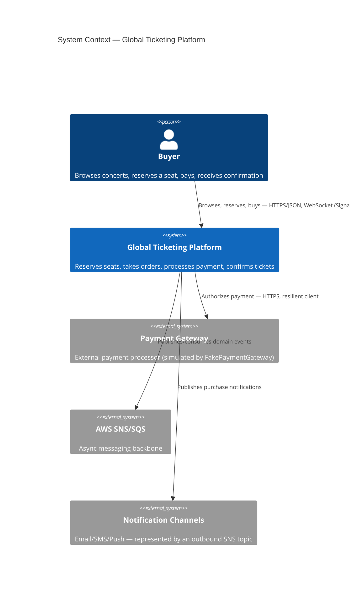

# System Context

```mermaid
C4Context
title System Context — Global Ticketing Platform

Person(buyer, "Buyer", "Browses concerts, reserves a seat, pays, receives confirmation")
System(platform, "Global Ticketing Platform", "Reserves seats, takes orders, processes payment, confirms tickets")
System_Ext(paymentGw, "Payment Gateway", "External payment processor (simulated by FakePaymentGateway)")
System_Ext(sns, "AWS SNS/SQS", "Async messaging backbone")
System_Ext(notifyChannel, "Notification Channels", "Email/SMS/Push — represented by an outbound SNS topic")

Rel(buyer, platform, "Browses, reserves, buys — HTTPS/JSON, WebSocket (SignalR)")
Rel(platform, paymentGw, "Authorizes payment — HTTPS, resilient client")
Rel(platform, sns, "Publishes/consumes domain events")
Rel(platform, notifyChannel, "Publishes purchase notifications")
```

See `ARCHITECTURE.md` §2 for narrative context.
